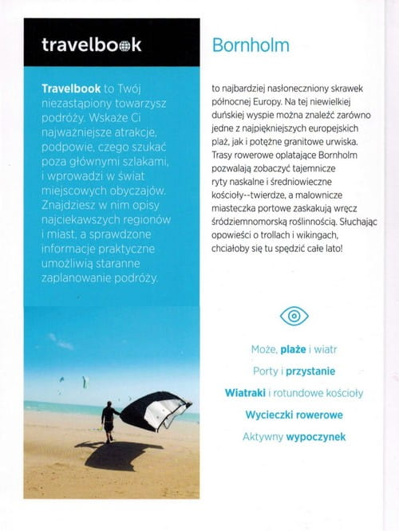
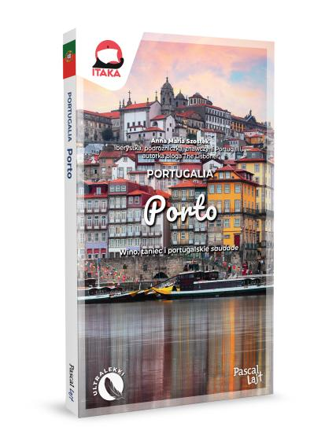
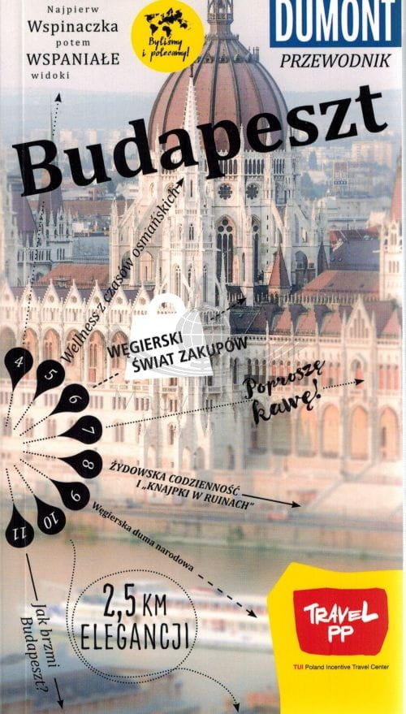

## Spis Treści
1. [O Przewodnikach](#intro)
1. ["Travelbook." - Wydawnictwo Bezdroża](#travelbook)
2. ["PascalLajt"](#pascal)
3. ["Dumont"](#dumont)

## O Przewodnikach 

Przewodniki turystyczne to dla wielu osób element konieczny podczas procesu przygotowywania się do podróży lub uzupełniania wiedzy już w jej trakcie. Zawierają w sobie wiele cennych elementów jak na przykład sprawdzoną wiedzę zwykle od lokalsów i ekspertó branży, praktyczne wskazówki, inspiracje na wycieczki także poza miejsce naszego pobytu, zwykle zawierają także plany miast i mapy, które pomagają w sprawnej nawigacji po mieście. Przewodnik może również być po porstu wspaniałą pamiątką z danej podróży, a jego poisdanie daje nam niezależność od baterii i zasięgu.

---

### Travelbook. Wydawnictwo Bezdroża 

Zawiera przede wszystkim podstawowe informacje, praktyczne rekomendacje, ciekawe trasy zwiedzania, mapy, a także wiele ciekawostek i przydatnych rozmówek. Atutem jest również udostępnienie w wersji papierowej kodu do wersji online. Przeowdnik jest niewielkich rozmiarów, a więc zmieści się do do kazdego bagażu.

---

### PascalLajt 

Przewodniki te są bogato ilustrowane przez to jest na pewno przyjazny dla oka. Zawierają również przydatne rozdziały pod tytułem "Warto wiedzieć", które wprowadzają w temat użytecznych informacji o danym mieście. Sprawdza się przede wszystkim na krótkie, miejskie wyjazdy jak citybreaki.

---

### Dumont 

Kieszonkowe wydanie tego przewodnika turystycznego pozwala na bezproblemowe umieszczenie go w swoim bagażu. Jest tam wprowadzona nietypowa narracja, a mianowicie wystepuje ona w formie kompasu, gdzie każda tematyczna wskazówka, czyli rozdział ma na celu wprowadzić w zupełnie inny wymiar oraz aspekt miasta.

