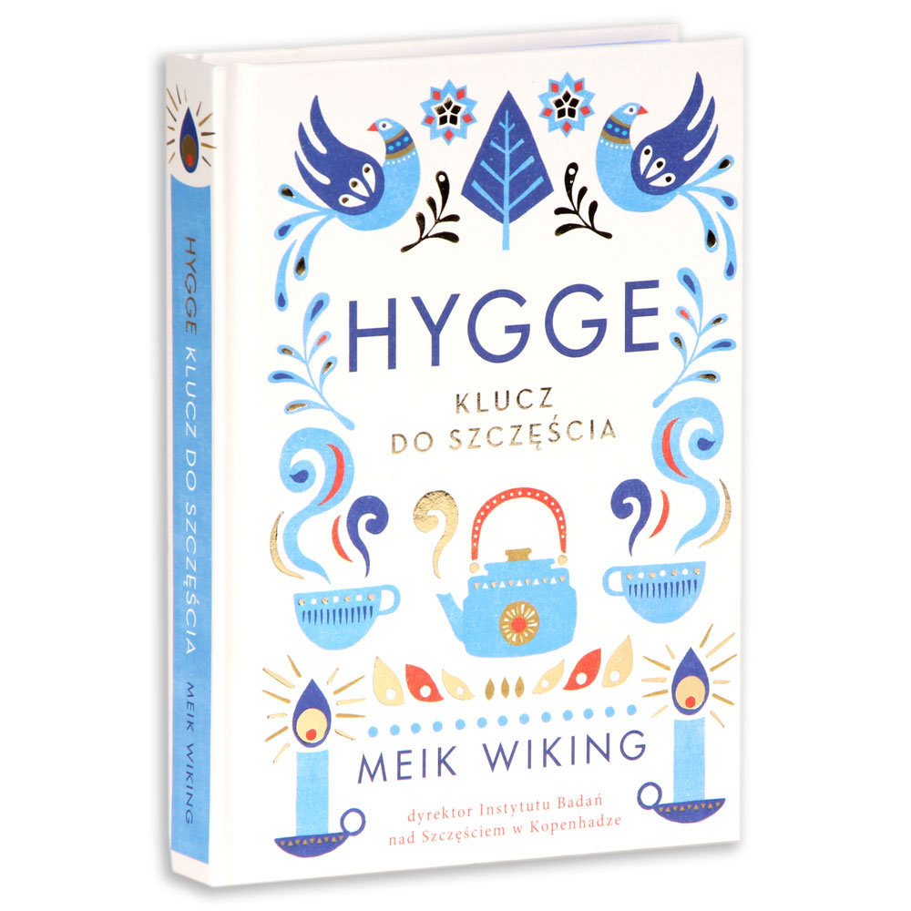
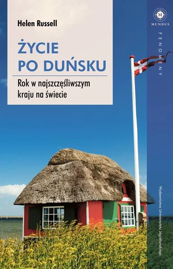

## Spis Treści
1. ["Krótko o Danii"](#Dania)
1. ["Hygge. Klucz do szczęścia." - Meik Wiking](#klucz)
2. ["Życie po duńsku" - Helen Russel](#poduńsku)
3. XXX

### Krótko o Danii 

Dania położona jest w Europie Północnej - Skandynawii i jest jednocześnie najmniejszym z państw nordyckich. Państwo składa się z półwyspu Jutlandzkiego oraz licznych wysp. Stolicą kraju jest Kopenhaga, która znana jest z nowoczesnej architektury i wysokiej jakości życia. Dania jest monarchią konstytucyjną oraz członkiem Unii Europejskiej. Z tego kaju pochodzi także słynna na cały świat firma produkująca klocki Lego.

---

### "Hygge. Klucz do szczęścia" – Meik Wiking 

Jest to lekki poradnik opisujący duńską filozofię życia hygge. Książka pokazuje, że szczęście nie musi wynikać z wielkich osiągnięć, tylko z codziennych, prostych przyjemności — takich jak na przykład czas z bliskimi, przytulna atmosfera czy umiejętność cieszenia się z drobizgów. Autor książki tłumaczy, na czym polega to podejście i podaje przykłady, jak wprowadzić je do własnego życia. Przeczytanie jej na pewno pomoże zrozumieć lokalną kulturę i zwyczaje.

---

### "Życie po duńsku" - Helen Russell 

Jest to książka w stylu reportażowo-lifestylowym. Opowiada o roku, który autorka spędza w Danii, próbując zrozumieć, dlaczego Duńczycy uchodzą za jeden z najszczęśliwszych narodów na świecie. Codzienne życie, kulturę, pracę, relacje społeczne i zwyczaje autorka opisuje z humorem i dystansem. Są to przede wszystkim obserwacje oraz osobiste relacje autorki.

