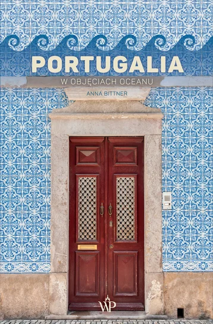

## Spis Treści
1. [Krótko o Portugalii](#Portugalia)
2. ["Portugalia. W objęciach oceanu. - Anna Bittner"](#Wobjęciach)
3. ["Portugalia. Tam gdzie zwalnia czas. - Krzysztof Gierak"](#Zwalniaczas)

### Krótko o Portugalii 
Portugalia położona jest w zachodniej części Europy Południowej na południowym zachodzie Półwyspu Iberyjskiego. Od północy i wschodu graniczy z Hiszpanią, natomiast od południa i zachodu oblewają ją wody Oceanu Atlantyckiego. Stolica kraju jest Lizbona, która jest jednym z najstarszych miast Europy i słynie z malowniczych ulic oraz widoków na ocean.W skład Portugalii wchodzą także dwa archipelagi wysp - Azory i Madera.

---

### "Portugalia. W objęciach oceanu" - Anna Bittner 

To książka z pogranicza literatury podróżniczej i reportażu. To opowieść o życiu w Portugalii "od środka". Autorka nie skupia się wyłącznie na atrakcjach turystycznych, ale przede wszystkim na codzienności, kulturze i mentalności mieszkańców — pokazując ich spokojne tempo życia, zwyczaje oraz charakterystyczny klimat kraju nad oceanem.

### "Portugalia. Tam, gdzie zwalnia czas" - Krzysztof Gierak, Julita Kucińska 

Jest to książka z pogranicza reportażu, przewodnika i opowieści o kulturze. Książka ta ukazuje Portugalię z różnych perspektyw - od historii i tradycji po krajobrazy i miasta na czele ze stolicą kraju Lizboną. Autorzy, którzy mieszkają na miejscu, starają się wyjaśnić dlaczego życie tam wydaje się spokojniejsze i bardziej zwolnione.

