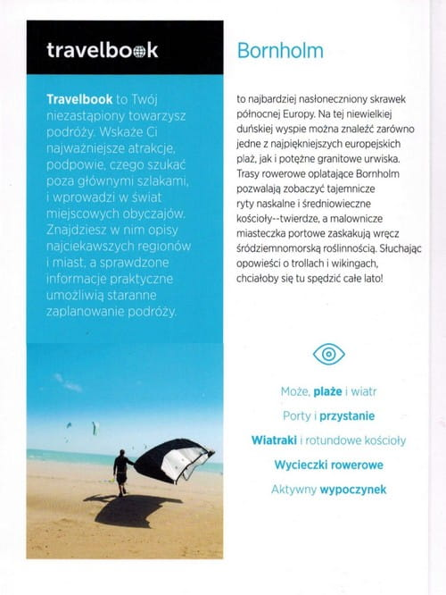
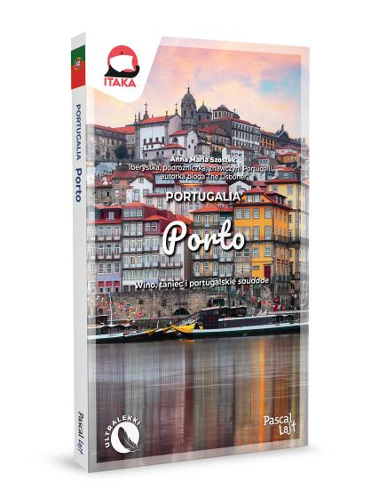
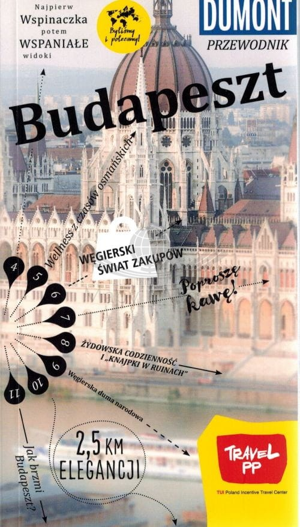

# Przewodniki turystyczne

Główne plusy fizycznych przewodników turystycznych:
- sprawdzona wiedza zwykle od lokalsów i ekspertów branży
- praktyczne wskazówki
- inspiracje na wycieczki
- zwykle zawierają także plany miast i mapy
- niezależność od stanu baterii i zasięgu
- pamiątka z danej podróży
  
## Spis Treści
1. ["Travelbook." - Wydawnictwo Bezdroża](https://github.com/gabbar-4/gabbar-4.github.io/blob/main/przewodniki.md#travelbook-wydawnictwo-bezdro%C5%BCa)
2. ["PascalLajt"](https://github.com/gabbar-4/gabbar-4.github.io/blob/main/przewodniki.md#pascallajt)
3. ["Dumont"](https://github.com/gabbar-4/gabbar-4.github.io/blob/main/przewodniki.md#dumont)

---

### Travelbook. Wydawnictwo Bezdroża

Zawiera przede wszystkim podstawowe informacje, praktyczne rekomendacje, ciekawe trasy zwiedzania, mapy, a także wiele ciekawostek i przydatnych rozmówek. Atutem jest również udostępnienie w wersji papierowej kodu do wersji online. Przeowdnik jest niewielkich rozmiarów, a więc zmieści się do do kazdego bagażu.

---

### PascalLajt

Przewodniki te są bogato ilustrowane przez to jest na pewno przyjazny dla oka. Zawierają również przydatne rozdziały pod tytułem "Warto wiedzieć", które wprowadzają w temat użytecznych informacji o danym mieście. Sprawdza się przede wszystkim na krótkie, miejskie wyjazdy jak citybreaki.

---

### Dumont

Kieszonkowe wydanie tego przewodnika turystycznego pozwala na bezproblemowe umieszczenie go w swoim bagażu. Jest tam wprowadzona nietypowa narracja, a mianowicie wystepuje ona w formie kompasu, gdzie każda tematyczna wskazówka, czyli rozdział ma na celu wprowadzić w zupełnie inny wymiar oraz aspekt miasta.

